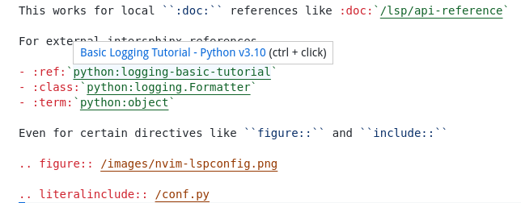

  </img>

<h1 align="center">Esbonio</h1>

**esbonio - (v.) to explain**

[reStructuredText]: https://docutils.sourceforge.io/rst.html
[Sphinx]: https://www.sphinx-doc.org/en/master/
[Language Server]: https://langserver.org/

Esbonio aims to make it easier to work with [reStructuredText] tools such as [Sphinx] by providing a [Language Server] to enhance your editing experience.
The Esbonio project is made up from a number of sub-projects

## `lib/esbonio/` - A Language Server for Sphinx projects.

The language server provides the following features.

**Completion**

  </img>

**Definitions**

  </img>

**Diagnostics**

  </img>

**Document Links**

  </img>

**Document & Workspace Symbols**

  </img>

**Hover**

  </img>

**Implementations**

  </img>

## `code/` - A VSCode extension for editing Sphinx projects

   </img>

This extension integrates the `esbonio` language server into VSCode, it's primary goal is to expose all of the features provided by the language server and serve as a reference for integrating `esbonio` into other editors.
Features that cannot be implemented primarily within the language server itself are out of scope for this extension.

For that reason, the Esbonio extension tries to integrate into the wider VSCode ecosystem where possible.

### Dependent Extensions

Esbonio depends on the following extensions

- By default, Esbonio relies on the offical [Python Extension](https://marketplace.visualstudio.com/items?itemName=ms-python.python) to configure the environment in which it builds your documentation.

- The [MyST Syntax Highlighting](https://marketplace.visualstudio.com/items?itemName=chrisjsewell.myst-tml-syntax) extension provides syntax highlighting rules for MyST flavoured markdown.

### Supplementry Extensions

The the following extensions are not required in order to use Esbonio, but you might find them useful

- The [reStructuredText](https://marketplace.visualstudio.com/items?itemName=lextudio.restructuredtext) integrates many other useful tools such as the traditional linters like [`doc8`](https://pypi.org/project/doc8/) and [`rstcheck`](https://pypi.org/project/rstcheck/).
  It also provides additional editor functionality for working with reStructuredText in general.

- While VSCode has included a vendored copy of the [reStructuredText Syntax highlighting](https://marketplace.visualstudio.com/items?itemName=trond-snekvik.simple-rst) extension since `v1.66`, installing the extension from the marketplace will provide you with the latest version of the syntax definition.

## `lib/esbonio-extensions/` - A collection of Sphinx extensions

