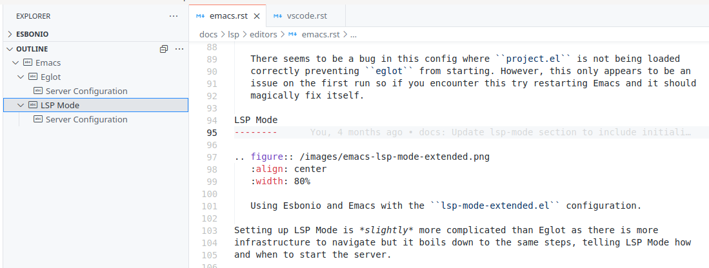
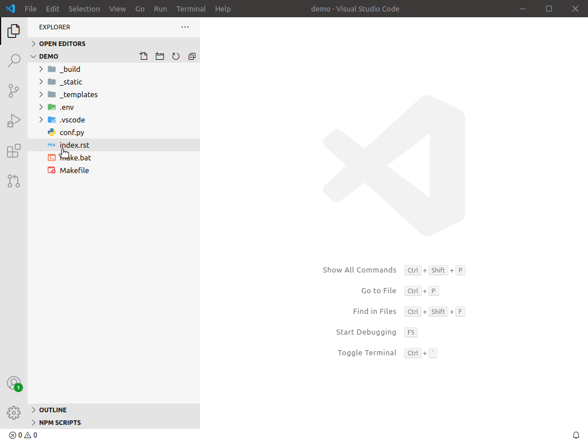

# Esbonio 

**This extension is in early development**

Esbonio is an extension that provides a language server for working with
[Sphinx](https://www.sphinx-doc.org/en/master/) documentation projects.

## Features

### Preview

The extension can show a HTML preview of the documentation


### Completions

The language server can provide completion suggestions in various contexts


### Goto Defintion

Goto definition is currently implemented for objects linked to by
`:ref:` and `:doc:` roles


### Diagnostics

Errors from a build are published to VSCode as diagnostics


### Outline

Sections within a document are displayed in the "Outline" view



## Setup

The language server works by wrapping an instance of Sphinx's application object,
inspecting it and exposing the results over the Language Service Protocol. As Sphinx is
a Python application this also dictates thats the Language Server is written in Python
and distributed as a package on [PyPi](https://pypi.org/project/esbonio/).

In order to correctly wrap your Sphinx application this requires the Language Server be
installed into the same environment as the one that you use to build your
documentation.

There are a number of ways this can be accomplished.

### Automatically

The extension does its best to automate the installation and application of updates to the
Language Server. By default Esbonio will use the Python environment you have configured
[Python extension](https://marketplace.visualstudio.com/items?itemName=ms-python.python)
when installing and running the server. If however, you don't have the Python extension
installed or you want to use a different Python environment for your documentation there
is a configuration option `esbonio.server.pythonPath` that you can use to configure the
environment.

There are a number of configuration options that allow you to control exactly how
installation and updates are handled. See the
[documentation](https://swyddfa.github.io/esbonio/docs/lsp/editors/vscode.html#configuration)
for more details.



### Manually

Alternatively you can opt to manage the installation of the language server entirely
yourself. To install the Lanaguage Server open the terminal in your desired Python
environment and run

```
(env) $ pip install esbonio
```

Then all you have to ensure is that Esbonio is configured to use the same environment,
either through the
[Python extension](https://marketplace.visualstudio.com/items?itemName=ms-python.python)
or through the `esbonio.server.pythonPath` configuration option.

To also manage updates manually, be sure to look at the
[documentation](https://swyddfa.github.io/esbonio/docs/lsp/editors/vscode.html#configuration)
for options on how to disable automatic updates.

## Alternatives

This project was created to scratch an itch, if it happens to also scratch an itch
for you then great! If not, here are some alternatives you may wish to consider

- [reStructuredText](https://marketplace.visualstudio.com/items?itemName=lextudio.restructuredtext)
