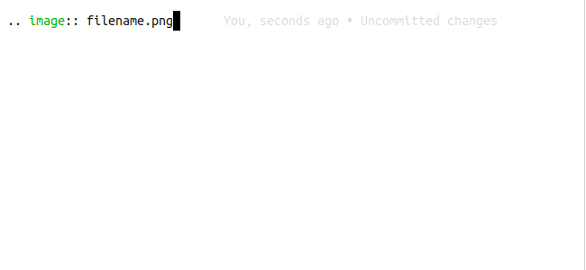
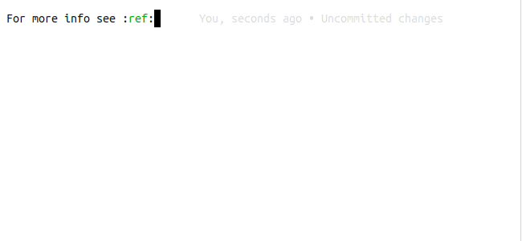
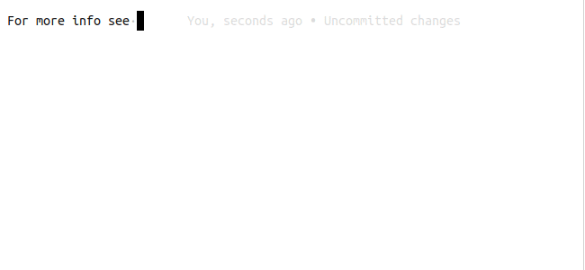

# Esbonio

**This extension is in early development**

Esbonio is an extension that provides a language server for editing
[Sphinx](https://www.sphinx-doc.org/en/master/) projects.

## Features

### Completions

The language server can provide completion suggestions in various contexts
#### Directives

#### Directive Options

#### Roles

#### Role Targets

For some supported role types

#### Inter Sphinx

The [intersphinx](https://www.sphinx-doc.org/en/master/usage/extensions/intersphinx.html)
extension can be used to easily link to other Sphinx projects. If configured, the language
server will offer suggestions when appropriate

### Diagnostics

Errors from a build are published to VSCode as diagnostics

### Syntax Highlighting

This extension also offers a simple grammar definition to enable some basic
syntax highlighting

## Alternatives

This project was created to scratch an itch, if it happens to also scratch an itch
for you then great! If not, here are some alternatives you may wish to consider

- [reStructuredText](https://marketplace.visualstudio.com/items?itemName=lextudio.restructuredtext)
