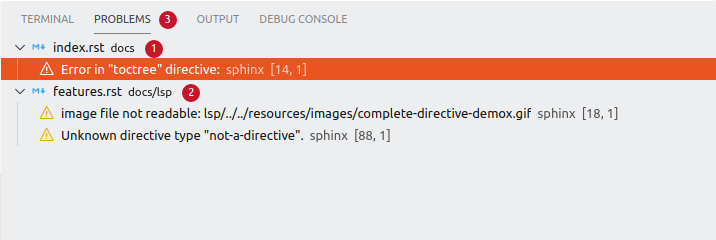
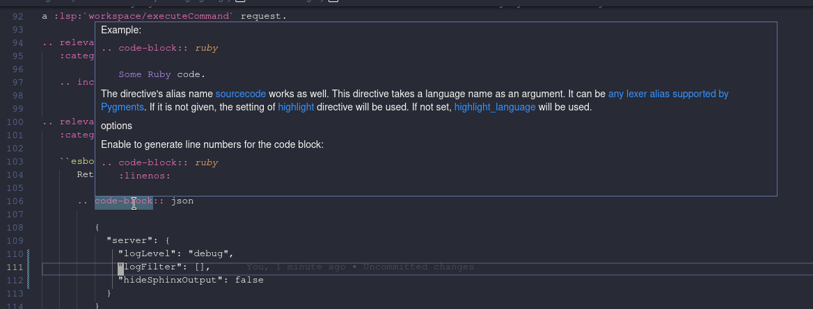
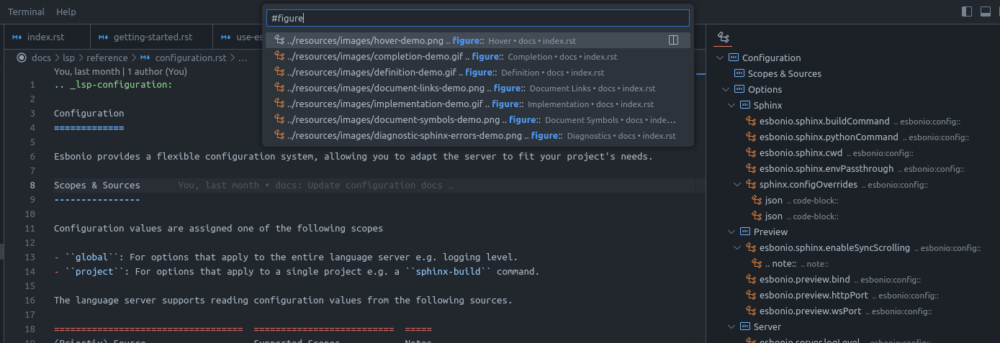

# Esbonio

The Esbonio extension integrates the [`esbonio`](https://pypi.org/project/esbonio/) language server into VSCode.

The `esbonio` language server aims to make it easier to work with [Sphinx](https://www.sphinx-doc.org/en/master/) documentation projects by proving IDE-like features to your reStructuredText and Markdown files.

## Features

### Live Preview

The extension can show a live HTML preview of the documentation, so the preview contents change whenever the document is updated.
Syncronised scrolling between the source and preview is also supported.

### Completions

The language server can provide completion suggestions in various contexts

### Goto Definition

Goto definition is currently implemented for objects linked to by
`:ref:` and `:doc:` roles

### Goto Implementation

Goto implementation is available for roles and directives

### Diagnostics

Errors from a build are published to VSCode as diagnostics

### Hover

Documentation is provided for certain roles and directives.

### Document & Workspace Symbols

Section titles and directives within a document are recognised as symbols and displayed in the "Outline" view.
You can also search for symbols within the workspace using the `Ctrl+T` shortcut.

## Setup

The `esbonio` language server is bundled with this extension, so there is no need to install it separately.
However, the server will need access the Python environment you use to build your documentation.

1. Open the folder containing your documentation project in VSCode, (opening a single file without an active workspace is not currently supported and will lead to errors).

1. Using the `Python: Select Interpreter` command from the Python extension, choose the environment you use to build your documentation.
   (You might be required to run the `Esbonio: Restart Language Server` command for it to take effect).

   Alternatively, you can set the `esbonio.sphinx.pythonCommand` option to override the python interpreter used.

1. Open a reStructuredText or markdown file from your Sphinx project.

1. Sphinx build output will be available in Esbonio's `Output` view in VSCode's panel.

## Supplementry Extensions

The [reStructuredText](https://marketplace.visualstudio.com/items?itemName=lextudio.restructuredtext) extension as of [v190.1.17](https://github.com/vscode-restructuredtext/vscode-restructuredtext/releases/tag/190.1.17) integrates many other useful tools such as the traditional linters like [`doc8`](https://pypi.org/project/doc8/) and [`rstcheck`](https://pypi.org/project/rstcheck/).
It also provides additional editor functionality for working with reStructuredText in general.
More details can be found on the [extension's page](https://marketplace.visualstudio.com/items?itemName=lextudio.restructuredtext).

The [reStructuredText Syntax highlighting](https://marketplace.visualstudio.com/items?itemName=trond-snekvik.simple-rst) extension provides syntax highlighting for reStructuredText files.
More details can be found on the [extension's page](https://marketplace.visualstudio.com/items?itemName=trond-snekvik.simple-rst).
