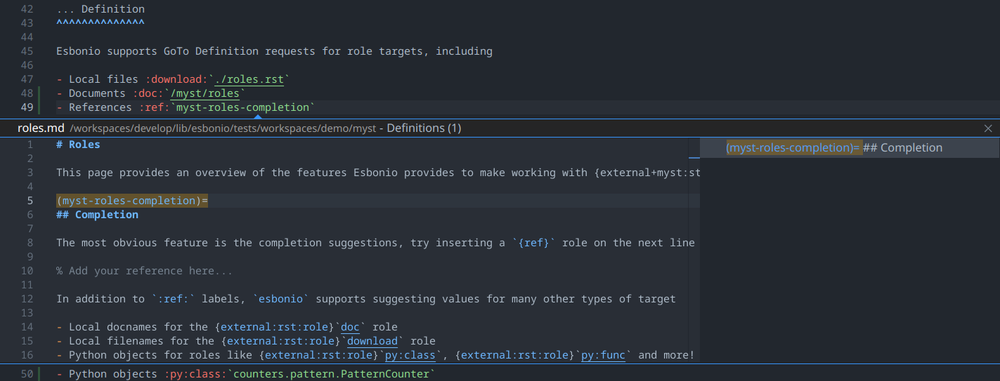
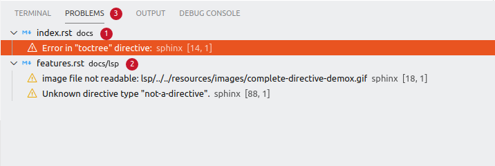
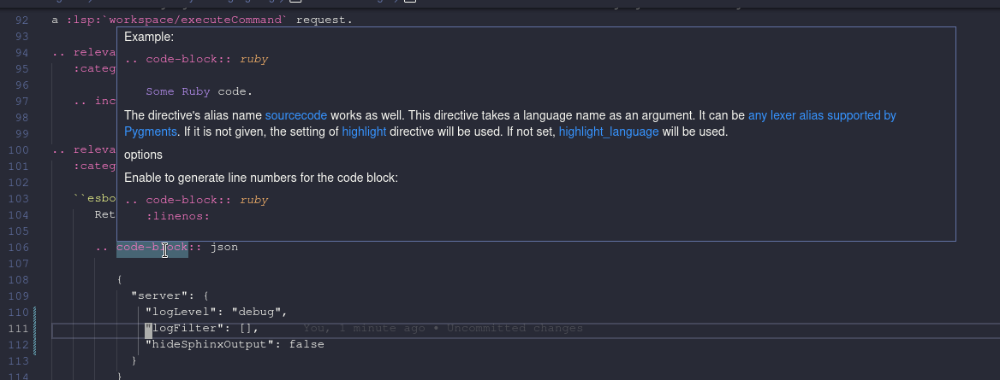
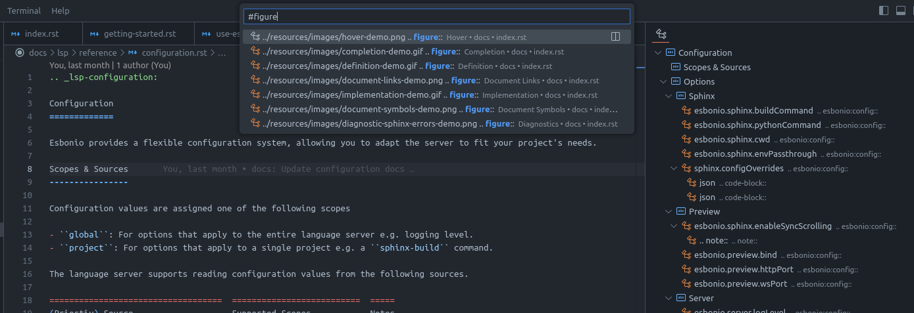
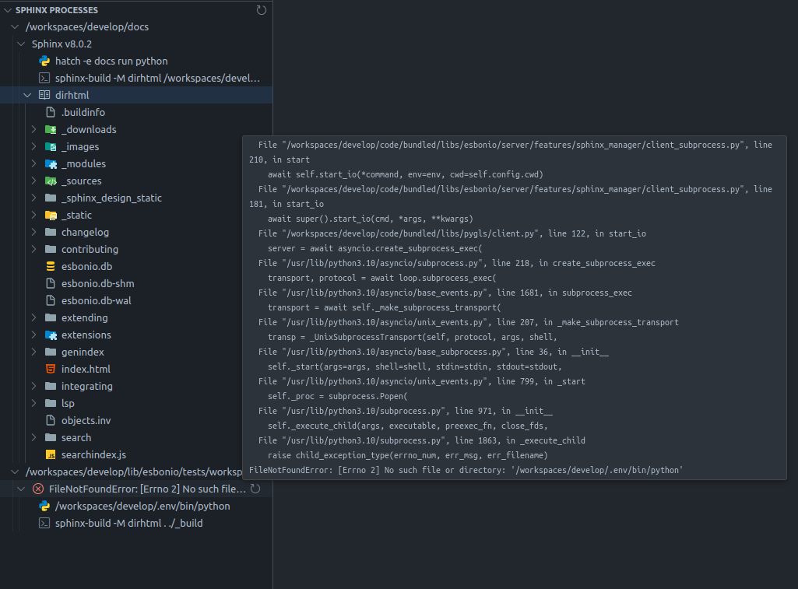

# Esbonio

The Esbonio extension integrates the [`esbonio`](https://pypi.org/project/esbonio/) language server into VSCode.

The `esbonio` language server aims to make it easier to work with [Sphinx](https://www.sphinx-doc.org/en/master/) documentation projects by proving IDE-like features to your reStructuredText and Markdown files.

## Features

### Live Preview

The extension can show a live HTML preview of the documentation, so the preview contents change whenever the document is updated.
Synchronised scrolling between the source and preview is also supported.

### Completions

The language server can provide completion suggestions in various contexts

### Goto Definition

Goto definition is implemented for objects linked to by `:ref:` and `:doc:` roles

### Goto Implementation

Goto implementation is available for roles and directives

### Diagnostics

Errors from a build are published to VSCode as diagnostics

### Hover

Documentation is provided for certain roles and directives.

### Document & Workspace Symbols

Section titles and directives within a document are recognised as symbols and displayed in the "Outline" view.
You can also search for symbols within the workspace using the `Ctrl+T` shortcut.

### Sphinx Process Management

The extension provides a UI to help visualise and manage the background Sphinx processes used by the server.

## Setup

It's recommended to follow the [Getting Started](https://docs.esbon.io/en/latest/lsp/getting-started.html) tutorial if you are using Esbonio for the first time however, to summarize.

The `esbonio` language server is bundled with this extension, so there is no need to install it separately.
However, the server will need access the Python environment you use to build your documentation.

1. Open the folder containing your documentation project in VSCode, (using the extension without an active workspace is not supported).

1. Set the `esbonio.sphinx.pythonCommand` option to select the Python environment used to build your documentation.
   See [this guide](https://docs.esbon.io/en/latest/lsp/howto/use-esbonio-with.html) for more details on its use.

1. Open a reStructuredText or markdown file from your Sphinx project.

If necessary, Sphinx build output will be available in Esbonio's `Output` view in the VSCode panel.
When troubleshooting, it's recommended to set the `esbonio.logging.level` option to `debug`

## Dependent Extensions

Esbonio relies on the following extensions

- The offical [Python Extension](https://marketplace.visualstudio.com/items?itemName=ms-python.python) is used to locate a Python interpreter compatible with the ``esbonio`` language server.

- The [MyST Syntax Highlighting](https://marketplace.visualstudio.com/items?itemName=chrisjsewell.myst-tml-syntax) extension provides syntax highlighting rules for MyST flavoured markdown.

## Supplementry Extensions

The the following extensions are not required in order to use Esbonio, but you might find them useful

- The [reStructuredText](https://marketplace.visualstudio.com/items?itemName=lextudio.restructuredtext) integrates many other useful tools such as the traditional linters like [`doc8`](https://pypi.org/project/doc8/) and [`rstcheck`](https://pypi.org/project/rstcheck/).
  It also provides additional editor functionality for working with reStructuredText in general.

- While VSCode has included a vendored copy of the [reStructuredText Syntax highlighting](https://marketplace.visualstudio.com/items?itemName=trond-snekvik.simple-rst) extension since `v1.66`, installing the extension from the marketplace will provide you with the latest version of the syntax definition.
