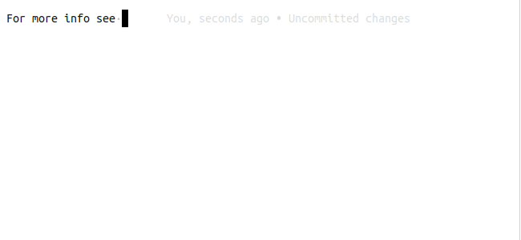

Features
========

This page contains a quick overview of the features offered by the Language
Server

Completion
----------

The Language Server can offer auto complete suggestions in a variety of contexts

Directives
^^^^^^^^^^

Completion suggestions are offered for the directives themselves, as well as any
options that they expose.

.. figure:: ../../resources/images/complete-directive-demo.gif
   :align: center

   Completing directive names

.. note::

   Currently the Language Server makes a hardcoded assumption that your
   ``primary_domain`` is set to ``python`` and has no knowledge that other
   domains exist.

   Support for additional domains will come in a future release

Roles
^^^^^
In the case of roles, completions can also be offered for the targets of certain
supported role types

.. figure:: ../../resources/images/complete-role-demo.gif
   :align: center

   Completing roles

.. note::

   Currently the Language Server makes a hardcoded assumption that your
   ``primary_domain`` is set to ``python`` and has no knowledge that other
   domains exist.

   Support for additional domains will come in a future release

Target completionss are currently supported for the following role type

.. hlist::
   :columns: 3

   * :rst:role:`sphinx:doc`
   * :rst:role:`sphinx:envvar`
   * :rst:role:`sphinx:ref`
   * :rst:role:`sphinx:option`
   * :rst:role:`sphinx:py:attr`
   * :rst:role:`sphinx:py:class`
   * :rst:role:`sphinx:py:data`
   * :rst:role:`sphinx:py:exc`
   * :rst:role:`sphinx:py:func`
   * :rst:role:`sphinx:py:meth`
   * :rst:role:`sphinx:py:mod`
   * :rst:role:`sphinx:py:obj`
   * :rst:role:`sphinx:term`
   * :rst:role:`sphinx:token`

Inter Sphinx
^^^^^^^^^^^^

The :doc:`intersphinx <sphinx:usage/extensions/intersphinx>` extension that
comes bundled with Sphinx makes it easy to link to other Sphinx projects. If
configured for your project, the language server will offer autocomplete
suggestions when appropriate.

   Completing references to the Python documentation.

Diagnostics
-----------

The language server is able to catch some of the errors Sphinx outputs while
building and publish them as diagnostic messages

.. figure:: ../../resources/images/diagnostic-sphinx-errors-demo.png
   :align: center

   Example diagnostic messages from Sphinx